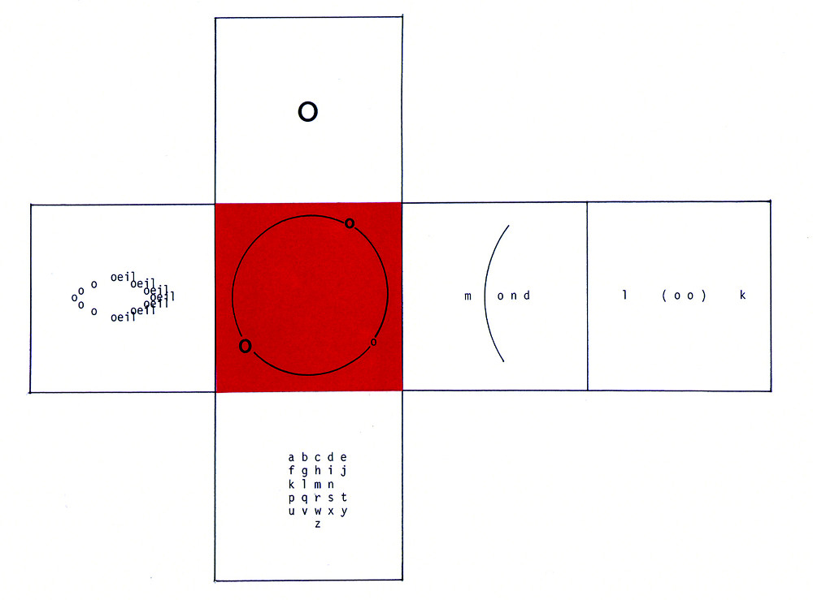

# 'Machines Poétiques'
## Introducing textual systems through experimental French poetry

Computational Arts MA/MFA Workshop, June 2024.

Iris Colomb & Jérémie Wenger

## Starter code

### Empty example

[P5.js sketch](empty-cube/)

### Empty animated example

[P5.js sketch](empty-animated-cube/)

### Ilse Garnier, 'Jeu de Cubes', from *Puzzle-Alphabet*, 1988

[P5.js sketch](garnier-cube/)

